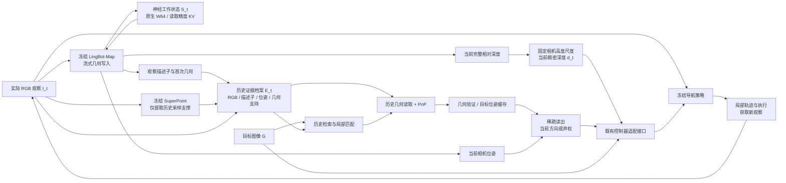

# GEM 最新架构、实现边界与进度总账

日期：2026-09-14，Asia/Shanghai。\
用途：统一团队对当前架构的理解，作为论文 Method、架构图和后续实验的工作说明。\
代码根目录：`/home/asus/Research/Nav-graph-blind`。\
本文只整理事实、设计与证据，不修改论文、控制器、运行实验或已有实验数字。

## 0. 先读这一页

**GEM（Geometric Episodic Memory，几何情景记忆）围绕冻结导航策略建立持续的视觉—几何记忆。观察更新记忆，目标查询记忆；当前完整深度服务局部导航，历史几何服务目标定位。**

当前集成候选已经从“统一旧接口”推进到两个明确的存储设计：

1. **历史几何支持档案**：在实际观察写入时，保存固定 SuperPoint 检测器可能访问的原始深度与置信度像素。未来目标查询直接读取，不再因选中某张历史帧而重跑历史 LingBot。
2. **神经缓存按读取精度保存**：保留原生 LingBot 的 token、窗口、提交及淘汰规则，将历史 K 原本在每次读取时执行的 FP32→BF16 转换提前到写入时。它改变缓存表示，不改变模型权重或注意力机制。

两个设计的共同原则是：**按现有读取操作实际需要的信息保存状态，并核验其读取结果，而不是通过删减历史语义、缩短几何上下文或降低定位要求来换资源。** 这是对当前实现的归纳，不是“信息论最小记忆”或新颖性的证明。

### 0.1 本次相对上一版说明的新增进展

|事项|现在的确切状态|
|---|---|
|`reader_precision` 神经缓存|已进入真实 `MemNavAgent` 构造参数、GEM 模块及服务器 CLI，不再只是诊断探针|
|短／长历史真实接口验证|234 和 1948 帧均完成，已发布位姿、DINO、历史档案、当前深度与真实几何查询精确一致|
|新集成候选连续导航|**4/4 条 A→B→A 链成功，12/12 段成功**；四组动作文件与原生 KV 支持档案对照逐字节一致|
|神经 KV 字节数|同样 token 与形状下，所检查普通／特殊 K/V 张量合计为原来的 **2/3**|
|带观测验证的服务峰值|短历史 14.103→10.767 GiB；长历史 18.289→13.117 GiB；不是整套系统的独立重复性能结论|
|组合候选独立重复成本|12/12 项及完整归约均已完成；短历史写入均值 +0.64%，长历史 -21.81%，服务显存峰值分别降低 23.65%／28.28%|
|默认配置及旧论文结果|没有自动切换；旧结果仍对应各自冻结版本|

**证据时点。** 本地连续测试在 **2026-09-14 01:03:56** 完成，成本计划在 **02:09:47** 核对时已完成全部 12 次及独立归约。HPC 在 **02:10:18** 再次远端查询，原生窗口／支持档案分别完成并已核验 44/70、4/70 组，A100 成本仍排队。动态完成度以各自时点为准；本轮只汇总已有实验，未增加 GPU 测试。

旧 `STATUS.md`、早期探针 README 中仍可能出现“连续验证进行中”“生产接口尚未接入”等历史语句。对于上述已完成项，以[集成连续归约](../.diagnostics/gem_connected_memory_20260913/reader_precision_continuous_001/independent_reduction.json)和[真实 API 独立核验](../.diagnostics/gem_connected_memory_20260913/reader_precision_integration_002/full_independent_001.json)为准。公共 `READ_PRECISION.md` 的连续验证段已同步为完成；历史计划保留原始记录。

## 1. 版本边界：当前候选不等于所有历史实验

### 1.1 当前集成候选

以下是配置含义说明，不是省略模型、环境和输入后可直接执行的启动命令：

```yaml
memory_mechanism: native_interval7
memory_geometry_storage: detector_support
memory_kv_storage: reader_precision
certified_reference_depth_source: online_history
LingBot_context:
  initialization_views: 8
  recent_full_view_window: 64
  keyframe_interval: 7
```

它采用同一个冻结 LingBot，原生 FP32 相机头、既有深度头、CUDA BF16 SDPA，以及原 SuperPoint／LightGlue／PnP／控制器。新 KV 表示要求所验证的原生 W64 配置及新建或已重置的流。

服务器和构造函数的默认值仍为：

```text
memory_mechanism       = legacy
memory_geometry_storage = dense
memory_kv_storage       = native
```

因此，**“代码里有新选项”不能解释为论文主表、远端旧 bundle 或真机进程都已经采用新选项。** 必须读取对应启动参数和运行收据。

### 1.2 几条实现路线不要混用

|版本／路线|工作状态|历史几何|定位与控制|当前定位|
|---|---|---|---|---|
|旧论文 GEM／legacy|旧 writer；各实验采用自己的窗口和提交配置|典型旧路径为选帧后 canonical 重放，随后缓存；也存在旧 online-history 分支|原有 GEM 读出与冻结策略|现有论文表述和旧实验的来源，不被本次自动替换|
|原生 W64＋完整档案|原生 interval7、W64、原生 KV|每帧完整 FP32 深度／置信度档案|沿用原读出|新存储的同配置对照|
|原生 W64＋支持档案|与上一行相同|关键点双线性采样支持档案|沿用原读出|已完成离线、在线、四链及完整本机存储成本验证|
|原生 W64＋支持档案＋读取精度 KV|同 token／窗口／提交规则，K 保存为读取所需 BF16|同一支持档案|沿用原读出|**本文主要解释的当前集成候选**|
|connected 分段连接|反复建立小上下文并连接坐标|首次预测档案|原读出|连续与长程存在退化，未作为当前推荐路线|
|原生 W16|缩小完整视图窗口|档案仍保留|原读出|长历史几何退化，保留为控制实验|

来源：[当前模块契约](../.diagnostics/gem_connected_memory_20260913/MEMORY_MODULE_CONTRACT.md)、[原生／connected 总结果](../.diagnostics/gem_connected_memory_20260913/RESULT.md)、[公共模块说明](../NavDP/baselines/memnav/gem/READ_PRECISION.md)。

## 2. 整体数据流

论文和架构图应首先呈现功能关系，再在子图解释存储细节：



读图注意：

- `G` 不进入实时几何写入器；计算目标描述子不等于把目标图写入实际历史。
- 神经 KV 和历史证据档案是两个存储位置、两种生命周期，不是两个独立导航策略。
- DINO 检索读取档案描述子，不是一个直接访问 LingBot KV 的新目标定位 head。
- 图中的两条读出是逻辑分支，不承诺实现层面异步并发或无阻塞。
- 主图可以只展示 NavDP；若加 ViNT／NoMaD，应画适配器差异，不能让它们接收不存在的深度／PointGoal 输入。

## 3. 状态定义、所有权和实际载体

论文层面仍可写：

\[
\mathcal M_t=(S_t,\mathcal E_t).
\]

其中，`S_t` 维持连续几何推理，`E_t` 为后续目标保存可检索证据。当前深度、固定尺度及目标会话缓存是模块同时管理的派生／运行状态，不必全部挤入主图的记忆公式。

|状态|内容|实际载体|谁读取|生命周期|
|---|---|---|---|---|
|神经工作状态 `S_t`|LingBot K/V、相机等原生状态|GPU 张量|下一帧 LingBot 推理|随观察更新；episode reset 清空|
|历史 RGB|实际收到的 JPEG 和身份|按帧图像文件|检索后的局部匹配、图像目标适配|跨目标保留|
|历史描述子|归一化 DINO CLS 特征|原有 CPU 记录；检索时有 GPU 工作区|目标—历史相似度计算|跨目标保留|
|历史位姿／内参|首次预测 pose9 及其坐标约定|CPU 元数据|历史 2D→3D 与目标坐标绑定|当前不被后续目标查询修订|
|历史几何支持|原始深度／置信度、像素索引、尺寸、尺度、身份|每帧一个无损压缩 NPZ|原 PnP 几何读取|跨目标保留，随观察增加|
|当前完整深度|本次写入的完整深度预测|一个当前 CPU 张量|当前稠密输入接口|新观察覆盖当前引用|
|尺度凭据|第一段因果前缀得到的固定尺度及有效性|CPU 结构化记录|深度米制化|一次确定，episode 内保持|
|目标会话缓存 `Q_G`|shortlist、定位结果／拒绝结果、目标位姿|模块内记录|后续方向更新及历史图授权|目标切换建立新会话|

实现入口是 `MemNavAgent.memory`，当前候选实例为 `EpisodicGEM`。原 `agent.cam_pose`、`agent.dino_cls` 等字段通过 `MemoryField` 指向同一记忆状态，不维护另一份独立历史。模型权重由 agent 持有，记忆对象引用该后端。

历史档案既不是 rosbag 本身，也不是可直接驾驶的全局地图。Rosbag 可以提供实际观测，运行时档案负责按帧关联图像与可查询几何。现有档案最多缓存一个解码后的支持记录；PnP 需要的原尺寸栅格在 CPU 临时构造，不是把所有历史深度常驻 GPU。

代码：[memory.py](../NavDP/baselines/memnav/gem/memory.py)、[episodic.py](../NavDP/baselines/memnav/gem/episodic.py)、[support.py](../NavDP/baselines/memnav/gem/support.py)。

## 4. Write：实际观察如何成为持续记忆

### 4.1 输入边界

几何写入器消费当前实际 RGB。它不消费目标 role、目标真值位置、模拟器深度或执行器里程计。当前 `EpisodicGEM.write` 会拒绝带入执行位移／偏航等旧诊断参数。

相机安装高度通过 reset／尺度标定提供；相机内参及预处理约定由既有接口管理。**RGB-only 感知不等于没有相机标定或高度先验。**

### 4.2 初始化与逐帧写入

初始八帧先收集，再共同完成初始化并产生对应几何。之后每个实际输入都产生自己的当前几何和描述子：

\[
(S_t,\widehat D_t^{\mathrm{rel}},\widehat C_t,\widehat T_t,f_t)
=\operatorname{Write}_{\phi}(S_{t-1},I_t).
\]

`f_t` 复用冻结图像编码得到的描述子；不是新增训练的 retrieval embedding。原始 RGB、首次位姿和几何信息按同一帧身份绑定。保存历史时可用该观察自身信息，但不能依据未来目标是否成功来决定写什么。

### 4.3 W64 与 interval7 到底控制什么

- W64 保留最近 64 个完整视图特征，另有 initial8，完整视图部分最多对应 72 个视图。
- 淘汰完整视图后保留哪些特殊 token，沿用 LingBot 原生规则。
- interval7 控制哪些观察提交神经 K/V；非提交观察仍参加当前推理、获得几何并写入历史档案。
- 历史档案不会因为某帧离开 W64 而被删除。
- 当前原生实验规程仍有 320 个提交视图边界，按此 interval7 对应最多 2186 个原始观察；它不是无限时长实现。

这三个概念要分开：**输入观察数、神经提交视图数、完整 token 工作窗口大小。**

### 4.4 首次估计不被目标查询改写

新目标可以查询旧帧、建立自己的缓存，但不会修改该帧保存的 RGB 或首次预测几何。当前候选没有全局 bundle adjustment、回环后重写历史相机、跨窗口坐标纠偏或目标联合更新实时流。

## 5. 历史几何支持档案：减小磁盘记录，不稀疏化当前深度

### 5.1 保存哪些像素

设固定 SuperPoint 检测器在历史 RGB 上输出关键点集合：

\[
\mathcal K_i=\operatorname{SuperPoint}(I_i).
\]

设 `pi_i` 是原 RGB 到 LingBot padding 深度栅格的既有坐标映射，`B(u)` 为既有双线性采样器在位置 `u` 访问的四个邻接像素。保存集合为：

\[
\Omega_i=
\bigcup_{p\in\mathcal K_i}\mathcal B(\pi_i(p))
\;\cup\;\{v_i^{\min}\}.
\]

`v_i^{min}` 是原置信度图中有限值的真实最小值位置；没有有限值时不加入。这保留了原零分位置信度过滤需要的统计量，不是新增人为置信度值。

每个历史几何记录保存：

\[
\mathcal G_i=
\left\{(u,\widehat D_i^{\mathrm{rel}}(u),\widehat C_i(u)):
u\in\Omega_i\right\},
\]

以及原栅格尺寸、坐标尺度、图像身份和记录身份。深度与置信度保留原 FP32 值，文件采用无损压缩。

### 5.2 为什么以后目标未知也能提前保存

在固定的检测器、图像与预处理条件下，未来 LightGlue 返回的历史对应点是这个历史检测点集的一个子集。提前保存所有检测点可能访问的采样像素，覆盖了不同未来目标可能选中的匹配子集。

写入时因此只需 SuperPoint 特征提取，不运行 LightGlue、PnP 或目标查询。写入阶段生成的 SuperPoint 描述子会释放，不填充或驱逐查询侧原有参考特征缓存。

### 5.3 等价性说的是什么

在原采样器、原尺度乘法次序、原置信度过滤和相同匹配条件下：

\[
\operatorname{ReadGeom}(\mathcal G_i,p)
=\operatorname{ReadGeom}(\widehat D_i^{\mathrm{rel}},\widehat C_i,p),
\qquad p\in\mathcal K_i.
\]

这是对固定读取操作所访问值的保留，不是恢复任意历史稠密深度的能力。未存位置保持未知；兼容原 PnP 接口时，会构造其他位置为 NaN 的 CPU 栅格。

真正匹配后会校验图像身份、采样支持和置信度统计约定。检测器改变或访问越界是接口不兼容，不能伪装成普通的“目标没有历史支持”，也不会偷偷重跑稠密深度补救。

### 5.4 它没有改变什么

当前完整深度仍原样保留给 NavDP；历史几何仍是首次预测，不更准确；SP／LG／PnP 不变；面积授权配置、目标角色和导航成功不参与存储选择。这里的“采样支持集合”与“匹配图像面积阈值”不是同一概念。

来源：[支持档案设计](../.diagnostics/gem_connected_memory_20260913/SUPPORT_MEMORY_DESIGN.md)、[原始离线验证](../.diagnostics/gem_connected_memory_20260913/depth_support_001/RESULT.md)。

## 6. 新增：按读取精度保存神经 K/V

### 6.1 原生写入和读取存在不同精度

在已核对的 LingBot 原生 CUDA BF16 SDPA 路径中：

- 新 K 在 RoPE 后为 FP32，并以 FP32 保存在缓存；
- V 已经是 BF16；
- 注意力实际读取时，历史 K 会转到 BF16。

原流程可概括为：

```text
新 K（FP32）→ FP32 历史缓存 → 每次读取整段转换 BF16 → 原注意力
```

新表示为：

```text
新 K（FP32）→ 转换 BF16 → BF16 历史缓存 → 原注意力
```

FP32 相机头、深度头、权重、查询 Q、token 数量、提交顺序、窗口大小及淘汰规则都没有因此更换。

### 6.2 为什么不是随意量化模型

令 `C` 表示原读取器已有的 FP32→BF16 转换。在当前原生缓存中，已保存 K 的操作是拼接、选择、reshape 和 clone，而不是对这些 K 做额外数值聚合。因此：

\[
C(\operatorname{concat}(K,k))
=\operatorname{concat}(C(K),C(k)),
\]

\[
C(\operatorname{select}(K))
=\operatorname{select}(C(K)).
\]

从空流开始，把转换放到每个新 K 写入之前，可以保留原注意力每次实际消费的 BF16 K 序列。原模型的原生特殊 token 处理也必须包含在这个检查中。

**保留的是原读取器看到的操作数，不是所有原 FP32 位。** 结论依赖已验证的后端与缓存操作，不能无条件外推到其他注意力实现、任意精度或新模型版本。

### 6.3 实际接入方式

`read_precision.py` 提供静态 `ReadPrecisionAttention` 类，由公开配置安装到 24 个全局注意力实例，保留相同权重对象。不是运行时从诊断目录生成函数，也不是新加一个有待训练的网络。

该选项要求验证过的源版本、CUDA BF16 SDPA、W64、eval 模式和可初始化的流。不支持的组合明确失败；不会根据 episode 成绩切到另一种 memory。

### 6.4 资源比例的正确分母

对一个形状相同的 K/V 元素对：

\[
\text{原字节数}=4+2=6,\qquad
\text{新字节数}=2+2=4.
\]

因此这些 K/V 张量的字节数为原来的 `4/6 = 2/3`。它不表示整个模型、全部显存、CPU 历史或磁盘档案也缩小 1/3。

代码：[read_precision.py](../NavDP/baselines/memnav/gem/read_precision.py)。实现说明与精确范围：[READ_PRECISION.md](../NavDP/baselines/memnav/gem/READ_PRECISION.md)。

### 6.5 为什么这次进一步优化 KV，而不是删除深度头

三个 1948 帧写入剖析和 24 条 GPU 轨迹的独立归因已经完成。主要 GPU 成本来自跨帧注意力、整段 KV 拼接／复制及读取转换；深度头约 11–12 ms，并非长历史下全部写入耗时的主要来源。完整几何档案编码／保存的 CPU 调用中位数约 59.9 ms，支持档案含 SuperPoint 提取的相应调用约 9.3 ms。

因此，历史支持存储针对磁盘记录及其编码／读取，而读取精度 KV 针对神经工作缓存。保留完整当前深度，能保持原局部控制输入；不应因为写入慢就推断“每帧深度必须取消”。这些是带观测的模块剖析，不与不同层级的 CPU／GPU 计时重复相加，也不替代新组合完整成本。

来源：[24 条 GPU 轨迹独立归因](../.diagnostics/gem_connected_memory_20260913/stream_profile_001/trace_complete_001/RESULT.md)。

## 7. Dense readout：当前 RGB 对应的完整深度

每次成功写入保存当前完整相对深度和对应 RGB 身份；`read_dense()` 直接复用这次预测，不重新推理整张当前深度。

稠密通道沿用原相机高度标定：最初 40 帧形成一个尺度凭据 `s_hat40`，之后固定。

\[
d_t=
\begin{cases}
0, & \text{尚未到启用帧，或标定明确无效},\\
\widehat s_{40}\widehat D_t^{\mathrm{rel}}, & \text{标定有效且帧绑定成立}.
\end{cases}
\]

尺度调用原 `compute_first40_scale_receipt`／LingBot 尺度实现；已知相机高度、原有地面估计和 1.15 修正保持不变。本轮没有重新调尺度。

实现用零基帧索引：前 40 次观察完成尺度计算，索引 40 起启用米制深度。不要把“第 40 次观察完成标定”和“第 40 帧已经输出非零深度”混用。

RGB-only 不代表输出无尺度。**传感器输入是 RGB，输出的当前深度通过相机高度先验转换为米制。** 历史定位方向继续使用未做该米制校准的共同几何并归一化。

目标定位拒绝时，当前深度通道仍保持同一单目配置，不切回传感器深度。帧错配、证据过期、流失败与正常“标定无效”的零深度规则也不是同一种状态。

来源：[dense.py](../NavDP/baselines/memnav/gem/dense.py)、[monocular_depth_runtime.py](monocular_depth_runtime.py)。

## 8. Sparse readout：目标如何通过历史被定位

### 8.1 目标会话和检索

目标图像 `G` 只参与查询。为其计算冻结 DINO 描述子，并与历史描述子比较余弦相似度：

\[
s_i=\cos(f_G,f_i).
\]

当前原有 shortlist 使用 top-8、最小时间间隔 4 帧；合规参考帧满足初始块之后及当前目标会话边界之前的因果约束。候选被冻结，不能因看到当前导航结果而重选测试目标。

top-8 是候选检索规模，不意味着八图联合三维推断。

### 8.2 局部匹配和参考视图选择

SuperPoint＋LightGlue 匹配目标与候选历史 RGB，Fundamental-MAGSAC 评估极线支持，然后沿用现有排序。最高排名且具备最低匹配支持的参考视图 `h*` 进入主路径的历史几何读取和 PnP。

排序中的几何支持指标与最终控制授权配置要分开。原 matcher、PnP 和授权策略没有被这次存储优化训练或重新定义。

### 8.3 从保存的深度恢复目标相机

对匹配像素 `p_j ↔ q_j`，其中 `p_j` 在历史参考图、`q_j` 在目标图：

\[
z_j=\operatorname{ReadDepth}(\mathcal G_{h^\star},p_j),
\qquad
x_j^{h^\star}=z_jK_{h^\star}^{-1}\bar p_j.
\]

令历史相机到共同坐标系的位姿为 `T_hat_h = [R_hat_h, t_hat_h]`：

\[
X_j^W=\widehat R_{h^\star}x_j^{h^\star}+\widehat t_{h^\star}.
\]

PnP-RANSAC 由 `X_j^W ↔ q_j` 得到目标相机的外参，并转换到相机到共同坐标系的约定：

\[
\widehat T_G=T_{W\leftarrow C_G}.
\]

目标图像不需要深度。历史几何是磁盘读取、解码和原采样，不是新的 LingBot forward；读出收据标为 `replayed_frames=0`。

### 8.4 几何验证的范围

验证负责决定一个定位结果是否可以影响控制，关注有限位姿、内点支持和重投影一致性。它不是 Novel/Revisit 标签预测，也不是完整机体碰撞安全证明。

当前代码仍保留 `strict_certificate`、`certificate_without_coverage` 和 `pnp_pose_available` 等实验授权配置。**`detector_support` 和 `reader_precision` 这两个存储名称不决定采用哪种授权配置。** 论文中的去面积配置不能由存储选项自动推断；旧实验按自身冻结参数保留。

内部核对：`certificate_without_coverage` 去掉两项图像 hull 面积要求，但保留其他既有条件；`strict_certificate` 仍含面积要求。存储支撑点集不是这两项面积条件。架构总图写“Geometric verification”即可，不用把代码中各历史实验分支的阈值堆到主图里。

代码：[sparse.py](../NavDP/baselines/memnav/gem/sparse.py)、[授权常量](certified_relocalization_contract.py)、[授权实现](certified_relocalization_runtime.py)。

## 9. 历史—当前关系、目标缓存与单位方向

### 9.1 记忆连接的是两个时刻

目标可以和历史图像匹配，而与当前图像没有足够共视。采用统一相机到世界记号，有：

\[
\widehat T_{t\leftarrow G}
=\underbrace{\widehat T_t^{-1}\widehat T_{h^\star}}_{\text{历史到当前}}
\underbrace{\widehat T_{h^\star}^{-1}\widehat T_G}_{\text{目标到历史}}.
\]

代数中历史位姿消去，不表示历史证据可以省去；`T_hat_G` 正是通过历史图像对应点和历史深度估计出来的。

### 9.2 当前方向

接受目标定位后，在会话内缓存目标位姿。机器人移动时，只用最新当前相机位姿更新相对平移：

\[
u_t=\widehat R_t^\top(\widehat t_G-\widehat t_t).
\]

相机轴为 x 向右、y 向下、z 向前。转换到控制器的前方／左方平面：

\[
v_t=\begin{bmatrix}u_{t,z}\\-u_{t,x}\end{bmatrix},
\qquad b_t=\frac{v_t}{\lVert v_t\rVert_2}.
\]

有效记录可写为 `c_t=(h*, b_t)`，否则为 `⊥`。这个记录既指出历史依据，也给出当前方向。

### 9.3 Scale-free 与漂移不是同一问题

对所有相机和目标共同作用的正尺度、坐标平移和旋转，当前相机下的单位方向保持不变；共同尺度在归一化中消去。

但不一致的局部位姿误差、历史深度误差、纯旋转时的虚假平移以及随时间增加的漂移，不会被一次归一化消除。相机高度校准解决的是尺度参考，不是这些相对几何误差。

### 9.4 缓存的效率与限制

首次读出包含检索、局部匹配、PnP；后续接受缓存主要更新方向。拒绝结果和 shortlist 同样按会话缓存。新观察写入不等于当前目标自动不断重新定位；目标切换建立新的会话，历史档案与流状态继续保留。

## 10. 控制器适配与执行

### 10.1 NavDP

接受时将单位方向转换成固定局部点提示：

\[
p_t^{\mathrm{cue}}=\rho b_t,\qquad \rho=2.5\ \mathrm m.
\]

NavDP 接收当前 RGB、当前单目深度、原始 ImageGoal，以及可用时的点提示。它仍承担原有目标编码、轨迹生成和 critic 评估；后续执行器负责跟踪和获取新观察。

2.5 m 不是估计目标距离，不要求一次直行 2.5 m，也不是一条已验证无碰撞的直线。回忆弃权时不附加该提示，保持相同配置的原生 ImageGoal 请求。

### 10.2 ViNT／NoMaD

|接口|接受时|弃权时|
|---|---|---|
|NavDP|原始目标图＋方向点提示＋当前深度|同配置原生 ImageGoal|
|ViNT／NoMaD|控制器目标图替换为已认证历史 anchor JPEG；外围保留方向用于朝向适配|原始目标图，仍由同一 RGB 控制器执行|

ViNT／NoMaD 不接收 NavDP 的深度或 PointGoal；原始目标保留在 GEM 查询和任务判定侧。它们并不是直接导航到目标原图之外又获得了目标 GT 位姿。

本轮新存储与新 KV 的四链闭环使用 NavDP；旧 ViNT／NoMaD 接口已有，并不等于三种控制器都完成了新 KV 组合的全量评测。

### 10.3 后向目标与物理朝向调整

已有 `FrontGoalAdapter` 在已发出的记忆目标位于后方时，先执行有界实体朝向调整，写入新的 RGB，完成后再重新规划。期间不不断重采样方向，也不虚拟旋转旧图像冒充新观察。

这一段是控制器外围的执行适配，不是 GEM 生成了另一套局部路径。现有实现也不能据此宣称完整机体避障或纯旋转几何绝无误差。

### 10.4 仿真真值边界

GEM 的目标定位和当前单目深度不读取模拟器目标位姿、角色标签或传感器深度。模拟器、成功判定和低层状态跟踪使用什么状态，是另一个执行／评测边界。

因此不要把“GEM 输入只有 RGB 与相机先验”写成“整个仿真实验从不使用任何真值”。本次存储验证沿用已封存执行器，不声称又重做了执行器或自主 STOP 验证。

代码：[图像控制器适配](image_controller_goal_adapter.py)、[后向目标适配](navdp_front_goal_adapter.py)。

## 11. 一次完整运行的时序

1. **Episode reset**：创建新的 GEM 状态与档案；选定固定 writer、历史存储和 KV 配置。
2. **初始观察**：前八帧完成原生初始化；随后逐帧更新并保存几何。
3. **尺度标定**：前 40 帧形成一次尺度凭据；之后当前深度使用同一尺度。
4. **新目标会话**：保留已有历史；建立该目标的历史边界与 shortlist。
5. **首次 Recall**：DINO 检索、SP/LG 匹配、历史几何读取、PnP 与验证。
6. **缓存会话结果**：保存接受定位或拒绝结果；目标图不写入实际观察历史。
7. **持续控制**：每个新观察更新几何；稠密读出返回当前深度；稀疏缓存用当前位姿更新方向；策略规划并执行。
8. **目标切换**：清理／重建目标相关会话；不清空 episode 记忆，不恢复到旧物理末态。
9. **Episode 结束**：评测收据独立保存；下一次 reset 不复用这一运行中的活跃状态。

### 三种“重放”必须分开

|行为|新版是否存在|含义|
|---|---|---|
|新查询为历史 reference 深度重跑 LingBot|**不存在**|从历史档案直接读取，`replayed_frames=0`|
|第一目标前载入已记录的实际观察前缀|某些评测存在一次|初始化同一份已记录历史，不是目标切换时反复重放|
|前 40 帧尺度额外计算|存在一次|隔离计算并恢复原实时流，非每目标的深度重建|

当前四链测试先载入一份已有观察历史，再真实执行 A→B→A；后续段沿实际末态和不断增加的记忆继续。它不是从空历史自主完成所有初始采集的新增端到端 benchmark。

## 12. 现在还有哪些神经网络、哪些训练没有做

|组件|是否神经网络|本轮是否训练|当前职责|
|---|---|---|---|
|LingBot-Map|是|否，冻结|连续几何、当前深度和相机位姿|
|DINO 图像编码|是|否，冻结|外观描述与历史候选检索|
|SuperPoint|是|否，冻结|关键点／局部特征；写入侧决定几何采样支撑|
|LightGlue|是|否，冻结|历史—目标局部对应|
|NavDP／ViNT／NoMaD|是|否，冻结|各自原有导航条件下的局部规划|
|支持档案选择、读取精度转换|否，新设计不是新网络|无训练目标|改变保存形式并保持对应读出|
|PnP、几何验证、方向归一化、适配器|主要为确定性几何／逻辑|无新增训练|目标定位、干预和控制接口|

所以“training-free”意为本任务不增加训练或 finetune，不是系统没有使用训练过的模型。旧 learned decoder、训练式 localizer、Pi3X、MASt3R、语义 expert 等分支没有因本次整合而自动进入当前主路径。

## 13. 最新验证总账

### 13.1 历史支持存储

|验证|规模|结果|能说明什么|
|---|---|---|---|
|离线几何提升|9 条历史、6028 帧|对应三维点与有效性掩码精确一致|固定检测器／读取器所需几何被保留|
|离线真实几何读出|151 查询，在两组冻结原始几何配置上对照，共 302 个结果|定位、接受／拒绝和方向读出一致|不是只比较文件大小|
|在线写入及重新匹配|234 帧、每臂 24 对真实重新匹配|输出、目标切换、后续写入和 reset 一致|不是离线回传旧答案|
|连续导航|4 条历史×完整／支持两种存储|两种均 4/4 链；合计 24/24 段；动作／RGB／位姿一致|原生 KV 下的存储替换在这四条链上不改变行为|
|存储成本|234／1948 帧×两种存储×三次独立进程|12/12 完成且核验|完整重复的档案及服务成本观察|

离线两组原始几何包括旧 W64 FP16 与 W16 FP32 来源；只在各自同一几何来源内比较存储表示。不能将两组不同窗口和原精度混成“同一几何的重复样本”。

来源：[离线](../.diagnostics/gem_connected_memory_20260913/depth_support_001/RESULT.md)、[在线连续](../.diagnostics/gem_connected_memory_20260913/support_online_001/continuous_001/RESULT.md)、[完整成本](../.diagnostics/gem_connected_memory_20260913/support_resources_001/complete_cost_analysis_001/RESULT.md)。

### 13.2 新 KV 与真实 API

|项目|234 帧|1948 帧|
|---|---:|---:|
|已发布位姿／描述子精确一致|234|1948|
|历史几何档案精确一致|234|1948|
|当前完整深度有效输出精确一致|227|1941|
|原 SP/LG/PnP 首次读出|一致|一致|
|尺度与最终深度 PNG|一致|一致|
|原生探针对照服务 Torch 峰值 / GiB|14.102546|18.288589|
|集成 API 候选服务 Torch 峰值 / GiB|10.766593|13.117271|
|本次观察到的峰值降低|23.65%|28.28%|

完整深度输出计数比 RGB 少七个，是初始化前七次尚未独立发布当前几何，不是丢失七条历史档案。初始化完成后八帧历史记录均建立。

原生／候选探针共四次 GPU 运行，真实公共 API 候选另有两次 GPU 运行。47 项相关 CPU 检查通过。这里保留原探针证据；另行完成的组合候选独立三次成本见 13.5，不将探针计时混入成本重复。

来源：[探针独立核验](../.diagnostics/gem_connected_memory_20260913/kv_read_precision_001/full_independent_001.json)、[真实 API 独立核验](../.diagnostics/gem_connected_memory_20260913/reader_precision_integration_002/full_independent_001.json)。

### 13.3 本次刚确认完成的集成连续结果

新候选为 W64＋支持档案＋`reader_precision`，比较对象是同四条历史已经封存的 W64＋支持档案＋原生 KV。

|场景|新候选完成目标|原生 KV 对照完成目标|最终累计观察帧数|动作文件比较|RGB／位姿序列审计|
|---|---:|---:|---:|---|---|
|gxdoqLR6rwA|3/3|3/3|604|逐字节相同|精确一致|
|pLe4wQe7qrG|3/3|3/3|738|逐字节相同|精确一致|
|yqstnuAEVhm|3/3|3/3|544|逐字节相同|精确一致|
|mJXqzFtmKg4|3/3|3/3|533|逐字节相同|精确一致|
|合计|**12/12**|**12/12**|**2419**|四组一致|四组一致|

整条链成功率为两种配置各 **4/4**，配对增／损为 **0/0**。这里的目的是数值与行为保持，不是宣称 SR 提升。2419 是四条运行各自包含初始前缀的累计观察计数之和，不是 2419 个独立导航样本。

完成时间为 01:03:56。本文额外复核四个逐任务审计文件的 SHA、成功段数，并直接比较四组 `evaluation/executor_actions.jsonl` 原始字节；RGB／位姿全序列一致采用已完成独立归约和逐任务证据，不冒充本轮重跑了导航。

这些是四条既有开发历史，复用同一总体，不是新外部场景，也不是三次独立计时。结果可以支持“这四条连续链上未改变原有控制行为”，不能自动升级为全任务的严格等价保证。

来源：[完整连续归约](../.diagnostics/gem_connected_memory_20260913/reader_precision_continuous_001/independent_reduction.json)、[完成收据](../.diagnostics/gem_connected_memory_20260913/reader_precision_continuous_001/execution_complete.json)。

### 13.4 原生 KV 下的完整存储成本

下表不是新 reader-precision 的最终成本；它比较完整／支持几何档案，并保留旧论文路径的单独参考实验。

|历史长度|配置|写入均值 ms/帧|Torch 峰值 GiB|历史几何 MiB|首次 Revisit ms|
|---:|---|---:|---:|---:|---:|
|234|旧论文 GEM，单独参考|207.958|21.987|按需重放|24782.341|
|234|W64 完整档案／原生 KV|212.688|14.103|398.895|187.322|
|234|W64 支持档案／原生 KV|159.298|14.103|10.038|153.754|
|1948|旧论文 GEM，单独参考|197.133|22.538|按需重放|9383.373|
|1948|W64 完整档案／原生 KV|328.678|18.289|3328.414|151.766|
|1948|W64 支持档案／原生 KV|305.810|18.289|76.379|148.710|

解释：

- 历史几何分别缩小 **39.74×／43.58×**，分母是完整历史深度／置信度档案，不是整个系统。
- 仅支持档案没有降低同 W64 的 GPU 峰值；新的神经 KV 优化才针对另一类存储。
- 首次查询的大幅减少主要来自预存几何、避免 reference 重放，完整 W64 档案同样享有；不能独占归因于关键点采样。
- 长历史支持档案三次写入总时间为 704.385／564.606／518.166 秒，全部保留。不能只挑最短一次。
- 同机有独立真机服务，实验跨暂停和设备负载变化；这些是完整记录的观察值，不是隔离硬件后的因果加速证明。
- 写入均值包括初始化和一次尺度标定，不是每一步稳定延迟。首次／缓存读出也不包括整个 NavDP、网络和执行链。

### 13.5 新组合成本与 HPC：只报告各自完成度

|计划|本文采用的完成记录|仍需完成|
|---|---|---|
|本机原生 KV vs reader-precision 独立成本|12/12 项完成并通过完整归约|已完成，复用结果|
|HPC W16／W64／旧 GEM 同卡新对照|02:10 记录为 44/70 历史、264 次导航通过独立配对核验|剩余历史和完整总体归约|
|HPC 支持／完整档案／旧 GEM|02:10 记录为 4/70 历史、24 次导航核验|其余历史；此数组仍是原生 KV，不是 reader-precision|
|独立 A100 存储成本|02:10 仍为排队、0/12|同一 allocation 下完整运行和设备绑定核验|

HPC 作业号分别为 `17688434`、`17690562`、`17691782`。本轮通过已有认证连接查询队列，并只对新完成结果做 CPU 归约，没有重提交、恢复或取消作业。两个 70-history 计划复用同一总体，不可加成 140 个独立新历史。

新的本机成本计划：[reader_precision_resources_001/plan.json](../.diagnostics/gem_connected_memory_20260913/reader_precision_resources_001/plan.json)。进度须读该计划自己的完成与归约记录，不使用旧支持档案成本冒充新组合性能。

完整 KV 成本结果如下，两种配置均使用同一原生 W64 和支持档案：

|历史帧数|Torch 峰值 GiB：原生→读取精度|摊销写入 ms/帧：原生→读取精度|结论|
|---:|---:|---:|---|
|234|14.103→10.767|164.191→165.250|显存降低 23.65%；平均写入未加速|
|1948|18.289→13.117|302.015→236.143|显存降低 28.28%；平均写入减少 21.81%，三次配对均更快|

均值包含全部三次。原生长历史三次总写入为 651.956／594.711／518.308 秒，新 KV 为 461.652／460.358／458.008 秒；短历史慢的一次亦完整保留。同机其他 GPU 进程仍在，故不据此宣称硬件隔离后的因果加速或整个系统的控制频率。结果、原值、图与 LaTeX 表格草稿见[完整成本报告](../.diagnostics/gem_connected_memory_20260913/final_memory_costs_001/RESULT.md)。

## 14. 为什么当前不再采用 connected 或小窗口作为主候选

先前完整 70 历史／46 场景、三种 memory×两类查询共 420 段结果已经完成：

|读出任务|旧 GEM|原生 W64＋完整档案|connected＋档案|
|---|---:|---:|---:|
|Revisit|68/70|69/70|68/70|
|Novel|19/70|18/70|23/70|

这组历史为 96–564 RGB，Revisit 初始测地距离约 2.035–3.926 m；它不是千帧长程闭环测试。原三臂也不是同一数组任务中共享同一物理 GPU，因此后来另做同卡对照。

connected 的 Novel 增益中，有 11 条相对旧 GEM 的新增成功完全没有记忆接管；不能解释为更好的回访定位。几何 writer 和稠密输入变化也会影响 frozen policy。

更关键的是，四条连续 A→B→A 链中旧 GEM／原生 W64 均 4/4，而 connected 只有 2/4。长历史亦出现显著关系退化。原生 W16 则有长历史几何退化，即使四条短链成功，也不能据此认为缩窗口没有代价。

当前候选因此保留原生 W64 的上下文与坐标延续，把工作放在存储表示；不按个别样例切窗口，也不把某个旧分支的最好结果拼成新方法成绩。

远期观察几何约束的 862 查询／500 合格查询／3933 次匹配只得到原生 W64 两次接受和 connected 一次接受，且含严重错误；当前没有据此部署坐标优化器。完整负结果继续保留。

来源：[完整旧候选结果](../.diagnostics/gem_connected_memory_20260913/RESULT.md)、[远期约束负结果](../.diagnostics/gem_connected_memory_20260913/remote_observations_001/RESULT.md)。

## 15. 对论文主线和架构图意味着什么

### 15.1 当前最合适的技术表述

> GEM 将实际 RGB 观察组织为连续几何工作状态和持久的视觉—几何档案。当前完整深度服务局部控制，历史档案把目标图像定位到过去的观察，并转成当前方向。新存储实现针对两个读取者保留其实际使用的信息，在已验证条件下减少历史几何与神经缓存占用，同时保留原定位与控制行为。

这里可以强调“一次观察、两种时间尺度、统一记忆接口”，但不宜把主贡献改成 BF16 或声称增加了训练出的长期记忆网络。

### 15.2 建议三面板

**A：整体运行关系。** `RGB → frozen LingBot → working state + episodic archive → dense/sparse readout → frozen policy`。主要突出状态所有权、两种读出，以及目标只查询不写入。

**B：写入与存储。** 以当前完整深度和历史关键点采样支持作对照；在工作状态角落加一个小型“store at reader precision”示意。不要画成另一套压缩网络。

**C：跨时刻回忆。** `DINO shortlist → SP/LG → archived geometry → PnP → current bearing`，用“历史相机—目标相机—当前相机”三个视点说明几何联系。验证是流程中的紧凑一步，不是占据半张图的数字门控表。

建议英文标签：

|图中模块|英文标题|一行解释|
|---|---|---|
|观察写入|Causal geometry writer|One observed RGB stream|
|神经状态|Working geometry state|Native context, reader-precision storage|
|历史档案|Episodic evidence archive|Appearance, camera pose and geometric support|
|当前深度|Dense current readout|Height-calibrated monocular depth|
|历史回忆|Goal-conditioned recall|Retrieve, match and localize from history|
|目标记录|Cached goal pose|Update direction with the current camera|
|适配接口|Frozen-policy interface|Directional cue or unchanged goal request|

### 15.3 不要画进去的内容

- 目标图推动实时 LingBot KV 更新。
- 从 KV 直接读出目标方向的新 learned head。
- 新训练 loss、decoder、MASt3R／Pi3X 或另一个 planner。
- connected 分段连接作为已采用主路径。
- 全局可通行地图、回环修正、无限长度或恒定总内存。
- 历史支持存储造成当前深度稀疏化。
- ViNT／NoMaD 消费 NavDP 的深度或点目标。
- 整体实时性、自动 STOP 或碰撞安全已由本次数值等价测试证明。

数值等价支撑实现替换，不能自行把旧论文所有表改标为新版已跑。尤其旧 writer→原生 W64 与原生 W64 内部存储替换不是同一种比较。

## 16. 当前仍需明确保留的限制

1. **长程漂移仍在。** 档案保留首次几何，读取精度保存原有注意力输入，二者都不修订历史／当前相机关系。
2. **固定目标会话限制重新发现证据。** 当前目标拒绝缓存不因每张新观察自动重新检索。
3. **不存在无限／恒定总内存结论。** RGB、描述子、位姿、历史档案及部分原生状态随观察增加；仍有提交视图上限。
4. **支持档案绑定固定读取器。** 不能无核验替换检测器、分辨率或置信度统计，也不能恢复任意历史深度图。
5. **单目高度尺度不等于可靠全局距离。** 固定 2.5 m 方向提示仍不包含全局路线和可靠终端距离控制。
6. **最新存储组合还没有全控制器／全真机验证。** NavDP 四链通过不能替代 ViNT／NoMaD、长距离及真实机器人适配测试。
7. **旧 Survey checkpoint 不能直接套到新模式。** 当前 `export_episode_state`／`restore_episode_state` 对非 legacy 格式明确拒绝；需新格式移植或按合规观测重建状态。这不等于真机新架构已一键部署完毕。
8. **局部几何验证不是避障或到达保证。** 原生策略、执行器、终端确认的责任仍需独立处理。

第 7 项代码边界见 [policy_agent.py](../NavDP/baselines/memnav/policy_agent.py)。

## 17. 收尾顺序与新增验证条件

当前固定候选为原生 W64／interval7、历史支持档案和读取精度 KV。已有正确性、真实 API、四条连续链和完整成本证据直接复用；本阶段继续收集已提交 HPC 计划，不新增同版本的重复验证队列。用户当前明确先不处理真机。

成本收尾应分别报告 GPU 峰值、历史几何档案、写入平均值及 P95、首次目标读出与缓存读出，并保留全部三次结果。旧论文路径、原生 W64 完整档案、支持档案和读取精度 KV 各有不同版本与计时批次；数值比较必须注明来源，跨批次耗时不能当作隔离单一因素的加速证据。若最后只支持显存与档案收益、未支持稳定延迟收益，就按该结论收尾，不通过追加次数或改窗口追求更好数字。

旧 Survey checkpoint 兼容性仅作为已知接口边界保留，本轮不开展真机保存／恢复或部署。当前同进程跨目标持续记忆已经验证。现有连续导航日志缺少完整请求／控制周期的起止时间，端到端实时性不能由缓存读出、整链 wall time 或离线写入吞吐推算为已验证结论。

|优先级|任务|所回答的问题|
|---|---|---|
|已完成|两种 KV 表示独立重复成本及可审阅图表|短历史平均写入未改善；长历史减少 21.81%；两者均降低显存|
|P0|完成现有两个 70-history 同卡对照及逐任务归约|新 writer／存储在完整冻结总体中是否保持预期行为？|
|P1|完成独立 A100 同 allocation 成本|能否在另一硬件环境复核存储成本，不混入跨机器差异？|
|P1|统一实际启用配置、论文方法说明与表格版本索引|哪些表来自旧路径，哪些验证支持新组件替换？|
|暂不开展|真机 Survey 状态格式、保存／恢复和部署|遵循用户当前范围|
|本轮保留限制|长程漂移／目标重新定位|存储优化没有解决这些定位问题|

本轮完成现有成本计划的汇总，并核验 HPC 新完成的输出，没有启动新实验。已存在的远端计划继续执行，文档不授权重复 GPU 实验或改动其冻结代码。

## 18. 最新代码入口与阅读顺序

|顺序|文件|重点|
|---|---|---|
|1|[READ_PRECISION.md](../NavDP/baselines/memnav/gem/READ_PRECISION.md)|当前集成候选的英文实现说明，已同步四链完成证据与剩余范围|
|2|[memory.py](../NavDP/baselines/memnav/gem/memory.py)|单一记忆所有权与兼容字段|
|3|[episodic.py](../NavDP/baselines/memnav/gem/episodic.py)|原生写入、当前深度、历史档案、KV 选项、错误边界|
|4|[connected.py](../NavDP/baselines/memnav/gem/connected.py)|底层原生／分段模式；当前使用 `bounded=False` 的原生路径，不能只看文件名判断架构|
|5|[support.py](../NavDP/baselines/memnav/gem/support.py)|支持集合、FP32 保存、读取与实际匹配支持核验|
|6|[read_precision.py](../NavDP/baselines/memnav/gem/read_precision.py)|原生全局注意力的读取精度缓存实现|
|7|[dense.py](../NavDP/baselines/memnav/gem/dense.py)|当前帧深度接口；同时仍保留 legacy 历史 provider|
|8|[sparse.py](../NavDP/baselines/memnav/gem/sparse.py)|检索、匹配、PnP、缓存目标、方向、授权历史图像|
|9|[policy_agent.py](../NavDP/baselines/memnav/policy_agent.py)|模型／记忆绑定、公开参数、旧 checkpoint 边界|
|10|[memnav_server.py](../NavDP/baselines/memnav/memnav_server.py)|实际 CLI 参数及服务器调用|
|11|[monocular_depth_runtime.py](monocular_depth_runtime.py)|尺度、帧索引与 RGB／深度绑定|
|12|[image_controller_goal_adapter.py](image_controller_goal_adapter.py)、[navdp_front_goal_adapter.py](navdp_front_goal_adapter.py)|RGB 控制器与后向目标的外围适配|

`gem/README.md` 主要讲 legacy 的模块化；`gem/EPISODIC.md` 主要讲早期 connected 候选；探针 README 描述冻结时的计划。它们都是有用历史资料，但不能优先于当前代码和最新完成收据解释“现在用的是什么”。

## 19. 证据索引与本次核对范围

证据根目录：

```text
/home/asus/Research/Nav-graph-blind/.diagnostics/gem_connected_memory_20260913/
```

|证据|路径／标识|
|---|---|
|当前统一模块契约|[MEMORY_MODULE_CONTRACT.md](../.diagnostics/gem_connected_memory_20260913/MEMORY_MODULE_CONTRACT.md)|
|完整支持档案成本|[complete_cost_analysis_001/RESULT.md](../.diagnostics/gem_connected_memory_20260913/support_resources_001/complete_cost_analysis_001/RESULT.md)|
|原生／新 KV 全历史独立核验|[kv_read_precision_001/full_independent_001.json](../.diagnostics/gem_connected_memory_20260913/kv_read_precision_001/full_independent_001.json)|
|真实公共 API 全历史独立核验|[reader_precision_integration_002/full_independent_001.json](../.diagnostics/gem_connected_memory_20260913/reader_precision_integration_002/full_independent_001.json)|
|最新四链完整归约|[reader_precision_continuous_001/independent_reduction.json](../.diagnostics/gem_connected_memory_20260913/reader_precision_continuous_001/independent_reduction.json)|
|最新四链执行完成|[reader_precision_continuous_001/execution_complete.json](../.diagnostics/gem_connected_memory_20260913/reader_precision_continuous_001/execution_complete.json)|
|组合候选独立成本计划|[reader_precision_resources_001/plan.json](../.diagnostics/gem_connected_memory_20260913/reader_precision_resources_001/plan.json)|
|旧 420 段与负结果总账|[RESULT.md](../.diagnostics/gem_connected_memory_20260913/RESULT.md)|
|HPC 保存的检查记录／后续入口|[STATUS.md](../.diagnostics/gem_connected_memory_20260913/STATUS.md)、[CONTINUATION.md](../.diagnostics/gem_connected_memory_20260913/CONTINUATION.md)|

本次实际复核的三个关键 SHA256：

```text
kv_read_precision_001/full_independent_001.json
a1323d692f177a733fe88ce4476298add984b4aa57c8cdb851164d2e69148cf4

reader_precision_integration_002/full_independent_001.json
4e27e3a26b97f84937625e8422a875ec6f446db72e269e01588d389735c69411

reader_precision_continuous_001/independent_reduction.json
eff67f0cd5e67470f8f881dcd129f49a6c4dcfe3ee14f57d980db51e56864607
```

本次没有重新运行 GPU／Habitat 实验，也没有重新测延迟；没有变更原审计收据、运行配置或论文。新文档仅汇总最新实现、已完成的独立验证和可直接检查的原始动作对照，避免旧状态描述滞后于实际完成情况。

## 20. 可直接复用的一段架构说明

**GEM 将机器人实际观察到的 RGB 序列组织为一个持续的几何记忆模块。冻结 LingBot-Map 维护原生流式工作状态，逐帧输出当前相机位姿与完整深度；当前深度经一次相机高度标定后提供给冻结导航策略。同时，系统把每帧 RGB、DINO 描述子、首次相机位姿以及未来局部匹配所需的原始几何支持保存到历史档案。收到目标图像后，GEM 从历史中检索候选，通过局部对应和保存的深度完成目标相机定位，再根据当前相机状态更新单位方向；定位不足时保留原生目标请求。新版分别针对两种状态保留读取器实际使用的信息：历史档案保存关键点双线性取样所需的原始几何，神经缓存按原注意力消费的精度保存 K。它们减少不同类型的存储占用，不新增训练，不改写定位或控制算法，也不把存储优化等同于长程漂移修复。**
