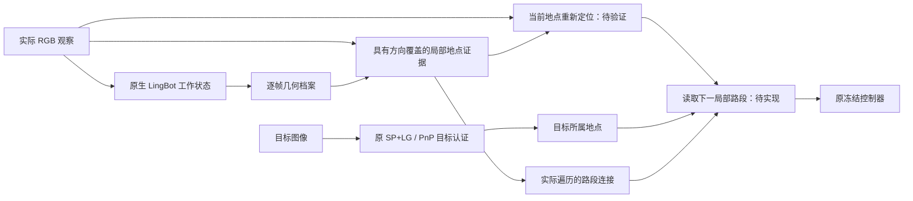

# GEM 长程方向：可重新定位的局部记忆

2026-09-14。状态：**设计与证据复用，尚未实现或验证新长程机制。**

2026-09-15 来源更正：先阅读[返向参考图像的来源更正](../.diagnostics/gem_longrange_observability_20260915/PROVENANCE_CORRECTION.md)。此前称为“独立真实回程”的额外参考，实际是脚本按真值反向位置和朝向在 Habitat 中渲染的 72 张图像，并非策略完成返程的记录，也不属于原前向记忆。真值最近位置选图下的 F 预检 2/12 → 11/12 仅是额外视图的信息诊断，不能作为当前记忆机制的增益。撤回优先接入这批返向参考做 DINO 验证的建议；后续保持原任务同一因果 RGB 输入，检查既有证据的保留和利用。下文关于主动回看或多方向采集的内容仅保留为额外采集协议的候选，不作为当前模块的默认前提或下一步。

[原封存审计](../.diagnostics/gem_longrange_observability_20260915/RESULT.md) 保留原字节与数值，其来源和下一步解释以上述更正为准。500 次窗口外查询均无三维 2 m 内的合格旧观测这一计算仍成立；不能将 2/500 解释为旧地点回访识别率，也不能仅凭位置/朝向断定不存在可用共视信息。

用户最新方向是尝试通过记忆模块改善较长程任务。这里先按“已走过区域中，较远目标的回访”设计，同时区分长历史漂移和路径绕行。关于优先处理目标距离还是历史长度的异步问题尚未收到回答；本设计是可调整的建议，不是对新实验、论文成绩或默认配置的既成声明。

## 1. 决策

建议研究的核心是：**机器人在较长回访过程中，能否不断用局部历史证据确认当前位置，并读取下一段可执行的路线。**

当前存储模块已经实现，现有几何支持档案和读取精度 KV 的收益继续保留。长程扩展需要增加的是可重新定位的地点证据和路线状态；仅扩大 KV、改变缓存格式或把全局位姿换成局部坐标，并不提供新的漂移校正信息。

该方向可能改善“曾经走过的路线如何再次走通”。它不自动解决未知区域探索、动态障碍导致的旧路线失效，也不等同于无限长度的流式重建。

## 2. 三个不同的问题

|问题|需要解决的缺口|本设计的作用|
|历史更长，几何关系漂移|当前观察与旧地点之间需要新的可观测约束|以局部记忆重新定位减少对整段累计位姿的依赖；仍需实验|
|目标更远，有门、拐角和绕行|终点方向没有表达接下来走哪条路|用观察到的路段连接组织中间目标；这是路线读取语义的扩展|
|视图数超过模型推理边界|原生流式状态有自身的索引、上下文与训练范围约束|独立问题；当前 W64/interval7 的提交上限仍保留，不能靠档案层宣称已解决|

LingBot 官方说明区分关键帧缓存和窗口推理，并明确记录训练视图范围及必要时重置的边界。这个边界不能从“磁盘存得下”推导为消失。[官方仓库](https://github.com/Robbyant/lingbot-map#streaming-with-keyframe-interval)

## 3. 必须复用的旧结果

以下是不同日期、不同冻结实现的开发证据，不能当作当前集成候选的新成绩，也不能跨总体合并成功率。

1. **较远同楼层任务已有路线实验。** 2026-09-03 的 23 条、8 场景、约 20.37–24.66 m 总体，单目 Base、终点方向、局部路线切向分别为 0/23、0/23、4/23。预先规定的确认条件未全部满足；其中 14/23 的路线分支发生几何流中断。历史来自受控因果 RGB survey，不是策略自主完成的前一段导航。[正式结果](HM3D_LONGRANGE_ROUTE_TANGENT_FORMAL_RESULT_20260903.md)
2. **反向视角是具体的信息缺口。** 旧 12-query 开发诊断中，同向历史地址 top-1 在 1 m 内为 12/12；约 180° 反向时为 0/12，top-8 仅 4/12。这不证明所有反向视觉定位不可能，但反驳了“现有前向历史一定可以稳定匹配回程”的假设。[根因审计](LONG_RANGE_REVISIT_ROOT_CAUSE_AUDIT_20260903.md)
3. **已有方法不能换名字重做。** Soft DINO 路线滤波在一个 prospective 路线上末端地址误差 5.16 m；更密的相邻 PnP 曾消除部分中断，但两个无中断案例仍失败。一个案例在距离真实目标还有 6.63 m 时，内部路线进度已经达到 100%。
4. **不能直接加入回环优化器就宣称解决。** 2026-09-13 的窗口外观测审计中，500 个合格查询、3,933 对匹配，原生 W64 只接受 2 条关系，而且包含严重误差。[完整记录](../.diagnostics/gem_connected_memory_20260913/remote_observations_001/RESULT.md)
5. **短包重估、额外单对匹配已有验证。** `LingBotReactivation` 已存在；额外观测匹配也没有稳定改善原有关系。把历史包和当前包再喂一次 LingBot、额外加入 top-1 PnP，均不构成尚未测试的新机制。[观测检验](../.diagnostics/gem_connected_memory_20260913/observed_constraints_002/RESULT.md)

推论：下一项长程研究必须明确它增加了什么可用信息，以及该信息为什么能在旧方法失败处观测到。一个更平滑的路线状态、更多历史边或新的模块名称本身不够。

## 4. 候选记忆的结构与真实改动范围

保留当前 `S_t` 和逐帧证据档案 `E_t`，另组织：

\[
\mathcal M_t=(S_t,E_t,\mathcal P_t,\mathcal R_t),
\]

其中 `P_t` 是局部地点记录，`R_t` 是实际遍历得到的路段关系。这个表达只定义研究对象，不宣称是一套已经成立的新算法。

**地点记录**包含一小段实际观察、帧身份、观察朝向、该局部范围的几何支持和相邻路段身份。来自同一地点不同朝向的真实 RGB 是关键候选信息，不能用多个高度相似的连续帧冒充多方向覆盖。

**路段关系**首先只记录真实走过的连接。时间相邻能证明一次实际遍历；它不自动证明静态障碍下的反向可执行性，更不能用视觉相似或漂移后的坐标距离擅自增加捷径。

**运行时定位**要用当前观察重新约束所在地点/路段。短期运动可提供预测，但不能仅以命令步数、全局位姿最近点或不断相乘的单对变换认定路线进度。已有 soft DINO 滤波的结果表明：缺少辨识信息时，换一种后验表示也不能解决问题。

**路线读取**从已认证的目标地点及当前地点决定下一个局部路段，给冻结控制器现有接口可消费的局部提示。路线接近目标时使用其已认证的目标记录，目标身份不由进度时钟自行覆盖。具体路段选择和推进规则需在机制验证前固定。

### 局部坐标的作用边界

将位姿改写成 `T_local = inverse(T_anchor) @ T_global` 只改变表示。若最终仍把所有相邻关系连乘回同一个远端目标，误差依然累积。潜在收益必须来自新的局部观测重新约束当前状态，以及只需完成下一段局部导航；不能宣称“存相对位姿就消除了漂移”。

### SP+LG 和控制器的作用边界

可以保持 SP+LG 权重、匹配算法、PnP 求解器和既有阈值，以及导航网络权重不变。但若调用它们做额外的当前地点定位，就新增了调用次数和计算成本；若从最终目标方向变成局部路段方向，就改变了记忆读出语义。**不能把这两类变化隐藏成纯缓存实现，也不能说整个计算图完全不变。**

若要求连读出语义也保持为单一终点方向，则记忆侧只能尝试改善跨时刻几何一致性；门口选择和绕行问题仍然存在。

## 5. 最先验证的变量：返程时有没有足够的局部证据

建议先做一个有明确问题的开发实验，而非直接启动一整批新长程导航：

> 在回访的转弯、近纯旋转和反向行驶阶段，局部记忆是否能从实际 RGB 得到稳定的位置约束，足以重新确定路线段？

首先清点既有长程记录可用的 RGB、方向覆盖、局部几何和历史身份，区分“证据不存在”和“有证据但匹配/几何估计失败”。旧的 23 条及失败边只用于开发诊断，所有失败保留；不重复已经完成的相邻 PnP、top-1 检索或短包重估。

如果已有真实观察包含侧向/返向覆盖，可以检验以地点组织这些证据的读取是否优于逐帧组织。候选选择不得用评分端真实位姿；用于判定观察覆盖的真值分析不得变成运行时选图器。

如果前向遍历没有足够覆盖，推荐研究**同一个 RGB 相机的显式回看采集**，作为独立的记忆写入策略：在预先固定的采集规则下获得实际返向观察，再比较返程时的定位覆盖和关系误差。它需要额外观察/动作/时间，必须记录；同预算或共享观察的对照才能区分记忆组织收益与额外数据收益。转动相机/机器人本身不保证有视差，也不保证深度或 PnP 可靠。

不优先用生成模型补全未观察的背面。当前 detector-support 档案只保留既有关键点采样值，不支持完整新视角渲染；真实观测的几何重投影也必须保留遮挡和未观测空洞，不能生成虚假几何证据。

这一阶段报告整个开发集合的定位覆盖、严重方向/位置错误、连续不可定位区间长度、额外观察与成本。不能只比较成功匹配的中位误差。判定规则在新比较前固定，不为进入下一阶段调证书、top-K 或运行时回退。

## 6. 验证顺序与继续条件

1. **机制阶段：局部再定位。** 新证据确实改善返程可观测性，并且严重误定位没有随覆盖率增加而增加；若无改善，停止这一设计，不用更大图优化器补救缺失观测。
2. **闭环阶段：保持相同证据和后端。** 在机制成立后，再比较同一观察前缀、目标、单目深度、冻结控制器和执行规则下的终点读出与局部路线读出。已有后向对齐规则保持一致。这样才能检验改动的记忆读出是否有用。
3. **确认阶段：新冻结总体。** 使用开发阶段未消费的历史，优先同楼层；将路线距离、转弯/绕行难度、历史长度分别记录或分层。旧总体只保留开发身份。

新长程总体与现有短程/连续回访证据分开。控制器终止、碰撞、路线丢失和未认证目标都计入结果；不能以历史目标曾经认证为由删除后续失败。实验数量与成功标准需要在实际运行前按候选机制固定，本设计不授权临时加跑到结果变好。

现有存储/HPC 计划继续作为原任务收尾；本次未查询其最新进度、提交新作业、占用 GPU 或替换默认候选。

## 7. 论文定位

长程扩展只有在机制与闭环成立后，才可能把贡献进一步明确为：**持久记忆不仅保存过去的几何，还提供能在较长回访中被重新定位和使用的局部证据。**

拓扑图和中间目标本身已有成熟先例。例如 ViNT 将局部视觉策略与拓扑规划、子目标结合，以支持较长距离导航。因此不能仅凭“加一张图”声称创新；需要证明我们保留的任务几何证据解决了当前方法的具体缺口。[ViNT 官方项目页](https://general-navigation-models.github.io/vint/index.html)

当前论文已经描述 W64、支持档案和读取精度 KV，并将其与导航主表的评价范围区分。本次不改 abstract、introduction、架构图、实验表或 limitation。新设计尚不能作为已实现方法加入论文。
