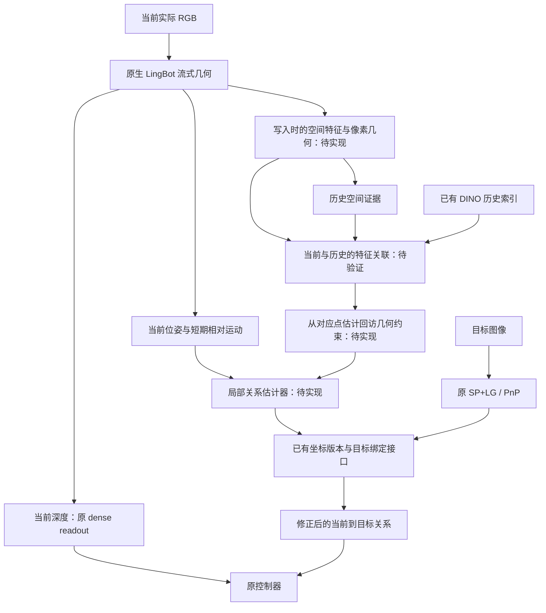

# GEM 长程适配：利用已有观察更新相对几何关系

2026-09-15。最新状态：**固定实际回访的空间特征试验已完成；直接第18/24层余弦匹配未达到可靠坐标校正所需精度。** 详见[完整结果](../.diagnostics/gem_spatial_revisit_20260915/RESULT.md)与本文第7节。此前架构建议保留为研究过程，不表示对应头、在线更新器或长程收益已经成立。本文不替换当前 native_interval7/W64 主路径，不修改论文，不启动闭环导航。所有输入限于查询时已经实际获得的 RGB；额外构造的 Habitat 返向参考不进入该方案，来源边界见[更正记录](../.diagnostics/gem_longrange_observability_20260915/PROVENANCE_CORRECTION.md)。

## 1. 结论与已有实现

建议把研究重点放在**利用 LingBot 的空间特征与预测几何产生回访约束，并让已有记忆坐标接口消费这些约束**。无需重新设计基本容器、坐标版本或目标绑定。

代码审计发现以下部分已经存在：

|部分|现有实现与边界|
|---|---|
|逐帧 RGB、描述子、位姿、读取支持档案|`gem/episodic.py`；保留当前 native 写入与原 SP/LG/PnP|
|版本化节点坐标、历史帧局部附着|`gem/bindings.py:EpisodicBindings`；估计器由调用方提供|
|将原 PnP 目标绑定到历史相机|`GoalAttachment` 与 `bind_goal`；无需重算匹配|
|同一坐标版本下更新目标方向及终端朝向|`MemNavData/gem_reference_readout.py:ReferenceReadoutSession`；实验适配器，尚未进入生产写入器|
|真实读出接口检查|[151 查询 × 3 分支的 453 个结果](../.diagnostics/gem_connected_memory_20260913/reference_readout_001/RESULT.md) 已完成；这是坐标代数与接口保持证据，不是定位收益|

当前主路径的 `SparseReadout` 仍缓存目标的首次 PnP 位姿，用最新 LingBot 位姿计算方向；没有实例化 `EpisodicBindings` 来发布视觉回访修订。新增研究对象应是**可观测关系的估计与在线更新**，不能把已有绑定层重新命名成新算法。

## 2. 对 LingBot 的利用方式

LingBot 的 GCA 已有初始锚点、近期完整 patch 上下文和较远历史的紧凑轨迹 token。原文也明确指出尚无显式闭环检测。因此不能把保留更多历史 token 本身作为我们的新机制。[LingBot-Map，方法与限制](https://arxiv.org/html/2604.14141v1)

建议保留原生流式几何作为连续预测，同时建立两类用途不同的记忆：

- **工作状态**：原 KV 与 camera head 继续处理新 RGB；不向在线 KV 随意插入、重排或拼接历史块。
- **可定位的历史证据**：在选定的已有关键帧上，除现有档案外，保存少量 LingBot 空间特征、像素地址及这些像素对应的首次预测几何。它们用于后来当前帧与历史观察的关联。

RGB 档案不因只给部分关键帧增加空间特征而被稀疏化。新空间特征是新增存储，不是对已有档案的无损压缩收益。

这里的空间特征读取是**独立于原 attention 输出的观测分支**。它改变计算量与最终几何读出，不应沿用无损 KV 的逐位等价声明。

## 3. 真正尚需验证的机制：从空间特征到回访约束

已有 DINO 全局描述子只负责给出固定预算的历史候选；在整个允许的历史范围内检索，不用真值位置，不只选择位置最近的一张图。候选相似度不能直接形成回环边。

候选机制的具体假设是：**LingBot 写入过程中产生的部分空间特征，能否提供跨时刻、跨视角的局部对应，再由它自己的深度和相机参数将对应转成几何测量？**

对历史像素 `u` 与当前像素 `v`，使用各自首次观测的深度和相机参数：

\[
X_h(u)=D_h(u)K_h^{-1}\tilde u,\qquad
X_t(v)=D_t(v)K_t^{-1}\tilde v.
\]

空间特征提出对应集合 `C_ht` 后，估计当前相机局部坐标到历史相机局部坐标的关系：

\[
\hat Z_{h\leftarrow t}
=\underset{s>0,R\in SO(3),p}{\arg\min}
\sum_{(u,v)\in\mathcal C_{ht}}
\rho\bigl(\|X_h(u)-sRX_t(v)-p\|^2\bigr).
\]

这是单目条件下的 Sim(3) 候选模型，不保证能描述全部深度/内参畸变。对应首先来自图像特征；不能只用已有漂移位姿生成最近点对应，再把拟合结果当成独立的回访证据。退化几何与内部重投影一致性必须单独记录；内部一致性也不等于真值精度。

短期多帧 LingBot 相对运动约束可联合限制同一活动局部节点，避免用一对图像的估计硬覆盖当前位姿。局部运动与回访测量进入同一个估计问题；没有可靠跨时刻约束时不能声称已经完成校正。原深度置信度不是校准过的位姿协方差，重复相关帧也不能当作许多独立测量。

### 为什么 attention 值得研究，但目前不能直接承诺

[VGGT-SLAM 2.0](https://arxiv.org/html/2601.19887v1) 展示了特定 attention 层可辅助检验检索图像的重叠，并将闭环测量与场景坐标优化分开。它没有证明 LingBot 同编号层也有效，更没有证明两个不同因果上下文中缓存的 Q/K 能直接成为精确匹配器。

本地 GCT 代码可以访问聚合中间特征与 attention 的 Q/K；但模型前向接口没有提供一个现成、已验证的跨历史对应输出。`query_points`/`enable_track` 参数的存在不等于可用 tracking head。应区分：

1. 原实际 attention 中的对应信息；
2. 取出缓存特征后另算的亲和度；
3. 几何求解器实际可用的像素对应。

它们不能互相替代。Video RoPE 的时间地址、特征所依赖的上下文、14 像素 patch 的定位精度都可能限制该候选。首个实验应固定少数明确层/特征定义，完整报告，不把 VGGT 的层号或阈值直接移植过来，也不根据结果不断挑层和调门限。

原 `detector_support` 档案只保存 SuperPoint 读取所需的深度采样。任意 token/patch 像素的深度并非都已归档；若新候选需要这些像素，应在第一次几何预测时额外保存。不能把未保存像素填值后称为真实历史几何。

## 4. 回访测量如何改变已有目标的方向

复用已有绑定表示。历史参考相机 `h` 定位目标后，缓存其局部关系 `T_(h←g)`。版本 `v` 提供当前和参考相机的坐标：

\[
T_{t\leftarrow g}^{(v)}
=\bigl(T_t^{(v)}\bigr)^{-1}
T_h^{(v)}T_{h\leftarrow g}.
\]

新的回访测量约束 `inverse(T_h) @ T_t`，修订活动节点或已有关联节点；方向与终端朝向从同一版本读取。原目标图像、参考身份、SP/LG 对应、PnP 与证书不被改写。

共同坐标变换 `A` 满足 `inverse(A T_t) A T_h = inverse(T_t) T_h`，所以给所有位姿统一旋转、平移或缩放不能改善当前到目标关系。真正的改进必须来自**不同时间位置之间相对关系的修正**。同一节点内的误差也不会因该节点整体移动而消失。

首次原型可以限定为当前局部状态对历史节点的重定位；只有存在足够可靠的非相邻约束时，再考虑同时优化更多节点。不能把简单链式连接称为闭环校正，也不能把局部重定位实验直接称为完成了全局 SLAM。

运行时接入仍需让写入器登记绑定、目标会话建立 attachment、方向及终端朝向使用新版本。保持原 SP/LG/PnP 算法与输入证据，不等于不需要这层集成。当前 dense metric depth 保持原路径，不能把坐标修订的尺度未经处理混入原安全/控制深度。

## 5. 与已有尝试的区别及代价

|已有工作|本方案的区别|
|---|---|
|W64 / reader-precision / 无损 BF16|这些保留或压缩原工作状态；本方案新增可测量的跨时刻关系，最终位姿可能改变|
|local16 / connected reciprocal|先保留原生写入；不通过反复重置和相邻段连乘来宣称消除漂移|
|历史 8 帧 + 当前 8 帧重新跑 LingBot|不把重估输出直接对齐后当校正；研究首次写入特征产生的显式对应与局部几何测量|
|已有当前帧/历史帧 SP+LG 探针|探针是逐对关系评估，尚无稳定的在线更新器；新候选必须与它做相同输入、候选预算下的比较|
|已有 EpisodicBindings / ReferenceReadoutSession|直接复用，不重写、不将其代数正确性当新精度证据|

历史 [8+8 重估](../.diagnostics/gem_lingbot_memory_reactivation_20260913/RESULT.md) 有明显尾部退化；[逐对 SP+LG 观测](../.diagnostics/gem_connected_memory_20260913/observed_constraints_002/RESULT.md) 也没有在所有指标上稳定优于原关系。任何新增测量器都可能更差，不能因为加了优化器就假定结果更好。

如果先用原 SP+LG 实现测量对照，它会增加当前帧与历史帧的匹配调用；这与目标定位的调用不同，成本必须计入。它只能是离线固定对照，不是在 LingBot 候选失败时运行的后端回退。

特征也并非免费：一个 `37×37×1024` BF16 张量为约 2.674 MiB；同形状 Q 与 K 合计约 5.348 MiB，尚未包括其他层、元数据或匹配工作区。候选特征可以在 CPU/磁盘保存，按参考批次读取，但总档案仍增长。是否比额外 SP/LG 调用更快，只能实测。

本方案借鉴的是 [MASt3R-SLAM](https://edexheim.github.io/mast3r-slam/) 将几何先验、实际关联和坐标更新配合起来的思想；不接入另一个 MASt3R 底座，也不声称通用相对位姿图或目标绑定本身新颖。

## 6. 试验前提出的验证范围（实际覆盖见第7节）

不重跑已完成的存储等价、绑定代数或闭环导航。先做**同一实际回访输入上的测量信息检验**：

- 使用已有、具有可核对时间顺序的实际回访 RGB。不能用整份未来返程序列作为过去记忆，也不能用额外渲染的返向参考。
- 原 DINO 候选覆盖整个允许的历史前缀。目标认证边界与“当前相机定位”的因果候选边界分别定义，避免把新任务变成只取最近空间帧的诊断。
- 固定候选预算，比较原生 LingBot 相对几何、原 SP/LG 关系对照与 LingBot 空间特征候选；保存所有失败和对应，而不只统计接受集。
- 真值只用于最终评分；既报告关联与几何误差，也报告较长不可定位区间、错误校正、当前到固定目标的方向、额外延迟和存储。
- 若候选特征未在旧写入中保存，新的特征采集需要一次明确标记的因果推理；不能声称已经从旧文件得到了这项证据。先列明缺失数据，再固定采集范围，不借此重新跑导航。

只有测量确实含有原连续预测没有利用的信息，才值得接在线更新器。最先要回答的问题是“能否从同一历史提取有用的回访约束”，而不是“是否能再写出一个图优化器”。

本方案首先针对长历史下的定位漂移与回访几何一致性。原生 320 提交视图协议、超范围后的模型状态重置、远目标绕行和下一路段选择仍是不同问题；当前 endpoint-bearing 与控制器保持原语义，不能因此承诺所有长程导航任务都解决。

## 7. 已完成的检验与下一步收敛

四条已有实际A→B→A记录、2,419帧、36个固定查询与288个相同DINO历史候选对已经完成。首次特征采集保留原生流式几何，2,391个可比较位姿的最大差异为3.309e-8（单位四元数表示）。不是重跑导航。

原DINO top1下，SP+LG、DINO patch、第18层、第24层分别有16/36、8/36、8/36、3/36通过原几何检查。接受且方向可评分的样本分别为12/4/4/2；历史参考方向误差中位数分别为1.421°、56.347°、47.003°、19.979°。不能把这些方向当成任务目标方向，也不能将不同接受集的条件中位数当相同总体比较。

主试验保持原PnP的历史内参复用约定。后验固定CPU对照使用当前帧自己的LingBot预测内参，不重跑任何特征或匹配；相同top1接受集上的方向中位数变为1.271°、25.000°、17.577°、10.862°。内参影响数值，但直接空间特征对应仍不足以接入坐标校正。全部样本、失败、层定义、成本和后验边界见结果文件。

实际历史并非完全没有可用视觉关系：SP+LG在36个查询中有23个至少存在一个通过的候选。然而，按检索顺序取第一个通过的候选，会在同一场景的两个相邻查询上产生170.7°与158.3°方向错误；使用当前预测内参也未消除。这个诊断不是生产目标参考排序，不能据此宣称原目标读出执行了错误校正。

因此，当前不接入新的token匹配头，不开展层号和接受门限搜索。下一项研究应更具体地利用LingBot提供的**短期相对运动、每帧相机参数与首次深度**，检验多帧是否能约束同一个局部坐标修正，而不是先搭完整全局图。

一个可检验的局部问题如下。固定历史局部坐标系h与活动局部坐标系a；历史观测点为`X_i^h`，LingBot给出近期第j帧相对于活动局部系的相机位姿`L_j = T_(a←j)`与预测内参`K_j`。图像对应提供像素`u_ij`，共同估计一个`Z = T_(h←a)`：

\[
\hat Z=\underset{Z\in\mathrm{Sim}(3)}{\arg\min}
\sum_{j,i}\rho\!\left(
\left\|\pi\!\left(K_jL_j^{-1}Z^{-1}X_i^h\right)-u_{ij}\right\|^2
\right).
\]

各帧共享同一修正量，局部运动来自原生流，不重新拼接历史8+当前8来重估几何。它直接利用原始对应及多视角投影约束，不平均单对PnP、不按单帧成功票数门控。单帧/无平移时尺度可能不可观测，多帧也不能保证消除深度畸变或系统性误匹配；这正是下一实验需要验证的部分。

若采用SP+LG作为记忆内部的观测对照，复用既有匹配实现与特征缓存，并明确计入额外调用成本；原目标SP+LG/PnP输入证据和后续控制语义保持不变。得到可靠局部关系后，由已有EpisodicBindings与ReferenceReadoutSession发布同一坐标版本。本节只是下一步数学假设，尚无新估计器实现或在线精度结果。
