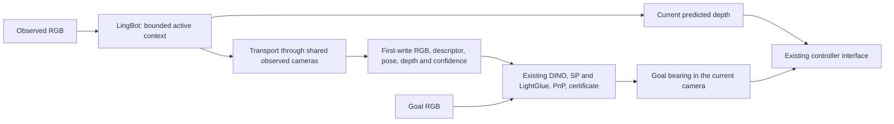

# Connected episodic memory

This document specifies the optional `connected_reciprocal` implementation.
The manuscript's current implementation remains `legacy`. The new module is
implemented and under a frozen navigation evaluation; this document is not a
claim of improved navigation success or publication readiness.

**Evaluation update (2026-09-13):** the complete four-history A→B→A
integration test found two completed chains for `connected_reciprocal`, versus
four for both legacy GEM and native interval7 W64 with the same archive.
Both failures retained accepted local target PnP while the current-to-target
bearing deteriorated during motion. This candidate is therefore an
experimental implementation, not the recommended final navigation method.
The complete 35-leg evidence is documented in
`.diagnostics/gem_connected_memory_20260913/continuous_002/RESULT.md`.
A separate fixed native W16 control is being evaluated; no outcome-dependent
switch among these implementations is introduced.

## What the memory retains

The memory separates the neural state needed to interpret the next observation
from the historical evidence needed to localize a future image goal.



There is one frozen LingBot model. Goal images never enter the geometry writer.
Reinitialization uses actual previously observed RGBs with known frame identities;
it does not use semantic retrieval to declare a loop closure. No learned writer,
additional correspondence estimator, confidence gate or alternative execution
path selects among memory mechanisms during an episode.

For historical observation `h`, the persistent evidence consists of its original
JPEG, DINO descriptor, camera pose in the first context's coordinates, local
float32 predicted depth and confidence, and the scale that converts that depth
into the same coordinates as the stored pose. The image/depth record is created
once. The writer does not revise historical records after a context transition.

## Causal write and context transition

1. The first eight RGBs initialize LingBot using its native scale block. The
   first seven calls buffer observations, as in the existing implementation.
2. Every subsequent RGB receives a geometry prediction. The fixed commit rule is
   `(frame - 8) % 7 == 0`; other frames use native skip-append.
3. A context holds eight initial/shared views and eight newly committed views.
   Before the next commit, the last eight committed RGBs initialize a new context.
4. The same eight camera identities and sampled pixel identities determine a
   similarity transform from the new context into the old context.
5. New observations are archived in the resulting common coordinates. Shared
   RGBs are reestimated only to connect contexts and update the working state.

The first transition precedes raw frame 64 and uses frames
`8, 15, 22, 29, 36, 43, 50, 57`. Later transitions occur every 56 raw observations.
The active state retains at most 16 committed views. A noncommitted prediction
temporarily attends to its own query in addition to that committed state.

## Coordinate relation

Let `(R_h, p_h, D_h)` and `(R'_h, p'_h, D'_h)` be the old and new estimates of the
same shared observation. Pixel sets `Omega_h` exclude padding and nonpositive or
nonfinite paired depths. All eight views have equal weight. The relation
`x_old = s R x_new + t` is computed as

\[
 R = \operatorname*{argmin}_{Q\in\mathrm{SO}(3)}
       \sum_h \|R_h-Q R'_h\|_F^2,
\]
\[
 \log s = \frac{1}{8}\sum_h\frac{1}{|\Omega_h|}
       \sum_{u\in\Omega_h}\bigl[\log D_h(u)-\log D'_h(u)\bigr],
 \qquad
 t=\bar p-sR\bar p'.
\]

Rotation is the proper orthogonal Procrustes solution. Scale minimizes squared
log-depth disagreement with equal weight per camera; camera centers determine
translation. This remains defined under stationary cameras because scale is
not inferred by dividing camera displacements. Reversing the two contexts gives
the inverse similarity, subject to numerical precision and an identifiable
rotation. This property does not imply that either estimate is accurate.

If `C_e` maps context `e` to the first context, then `C_(e+1) = C_e S_(e,e+1)`.
Writing a pose applies the rotation and translation of `C_e`; writing its depth
retains the local values and records the scale of `C_e`. Reading that depth
multiplies it by this same scale. Confidence remains dimensionless. The unchanged
PnP therefore receives depth and camera poses expressed in compatible units.

The current dense prediction is converted into those same first-context units.
The existing causal first-40 camera-height calibration supplies the scale used by
the controller. Its temporary inference runs in an isolated context and preserves
the active writer state. This uses the configured camera height and predicted
geometry; sensor depth and simulator motion are not geometry inputs.
The 16-view bound describes the main online context. The one-time calibration
also needs temporary neural workspace for its fixed 40-frame prefix; that
workspace is included in the measured GPU peak.

## Readout and lifecycle

The module implements the existing `write`, `read_dense`, `retrieve`, `read_sparse`
and `reset` interfaces. Dense readout reuses the newest prediction. Sparse readout
uses the existing DINO shortlist algorithm, SP/LightGlue, PnP, certificate and
current-relative bearing calculation. The numerical features and geometry can
change when the writer changes; identical readout code does not imply identical
candidate identities or accepted poses in every runtime configuration.

The existing target-session cache stores the accepted PnP result. Subsequent
reads update its bearing using the latest camera pose. Goal changes preserve
historical evidence; A-to-B-to-A starts a new A session. A failed neural or archive
write invalidates the episode, and further writes/reads require a reset. Missing
historical depth is an error. The writer never silently invokes another model.

Current integration supports the existing endpoint-bearing controller path.
Learned-policy planning caches and experimental graph-rescue modes are outside
this implementation. The legacy flat survey-checkpoint format does not include
the connected stream, so export and restore explicitly raise `NotImplementedError`
for the new modes. Canonical depth replay and alternate depth-provider overrides
are also rejected: stored poses must be paired with this writer's archived depth.
The frozen navigation runner resets and replays each complete RGB history.

During the first seven observations, RGB is buffered and there are no completed
geometry records yet. A goal without eligible prior views has an empty shortlist;
this is a normal geometric abstention. The constructor requires the existing
visual matcher and `online_history` depth for the two new memory configurations.
Changing a goal clears that goal's retrieval/localization state while retaining
the observed history. In particular, returning from B to A creates a new A
session with a new causal candidate boundary.

## Running the evaluated integration

Use `MemNavAgent` to construct the memory so the model, calibration, archive and
readout configuration stay synchronized. The frozen runner below already supplies
the tested LingBot settings, original matcher, monocular depth and controller
arguments. From the repository root, a separate local reproduction can be run as:

```bash
/home/asus/miniconda3/envs/memnav/bin/python \
  MemNavData/run_gem_memory_navigation.py run \
  --plan .diagnostics/gem_connected_memory_20260913/navigation_local_plan.json \
  --index 0 --mode connected_reciprocal \
  --out /tmp/gem-connected-navigation-reproduction \
  --mem-port 21740 --nav-port 21741
```

The output directory must be new and the two ports unused. This runs both roles
of one pre-existing local history; it is not the full population experiment.
The example uses the recorded local environment and data paths. For another
machine, stage the referenced RGB/scene/checkpoint assets and pin the new plan
before running; do not edit a plan that already has results.

The server option is `--memory_mechanism connected_reciprocal`, together with
`--certified_relocalization`, `--certified_reference_depth_source online_history`
and the existing LightGlue dependency arguments. `GET /memory_status` exposes
the memory mode, observation/geometry counts, active committed views, archive
bytes and failure state. `episodes` in that diagnostic payload counts local
geometry contexts, not independent navigation trials.

## Cost and limits

For `N` RGB observations, the main neural context is bounded by 16 committed views. Each
transition adds eight reestimated views per 56 new raw observations, approximately
14.3% additional image evaluations asymptotically. This count is not a runtime
estimate: attention length, block batching, output heads and archiving contribute
differently to actual cost.

Descriptors, poses and metadata use CPU memory proportional to history length.
RGB and lossless float32 depth/confidence occupy growing disk storage. Descriptor
retrieval also remains linear in history length. The unchanged DINO retrieval
temporarily copies the descriptor matrix to the GPU, so query workspace can grow
with `N` even though the neural context is bounded. The implementation therefore
does not provide constant total memory, constant query time, or a compressed
semantic map. The resource experiment measures GPU allocation, sampled process
GPU usage, CPU RSS and storage separately.

Shared-view alignment transports coordinates; it does not provide independent
long-range constraints. Rotation, translation and scale errors can accumulate.
Reciprocity cannot correct this accumulation. The development evidence includes
both improved and degraded goal bearings and must be reported alongside the
complete navigation results.

## Experimental comparisons and evidence

- `legacy`: the current writer, W32, flow-auto commit and canonical selected-depth
  replay, matching the manuscript's current memory path.
- `native_interval7`: native FP32 camera head, W64, fixed interval seven, directly
  archived historical depth, and a maximum of 320 committed views in the protocol.
- `connected_reciprocal`: the same native writer/storage conventions as the second
  configuration, with the bounded connected contexts described above.

The second comparison helps distinguish bounded-context effects from the combined
frontend/storage changes relative to the manuscript implementation. It does not
independently isolate every frontend change. All three retain the original
SP/LightGlue/PnP/certificate and controller code.

The frozen navigation plan covers 70 Table-I histories, both Novel/Revisit goals,
and all three modes: 420 rollouts. Four histories overlap scenes used in tonight's
candidate design; that overlap is explicitly marked. Existing benchmark data are
not represented as newly collected test data. Results are independently checked
against actual executed trajectories and paired by history and goal. Confidence
intervals resample whole scenes, not correlated prefixes.

The resource protocol uses two preselected histories (234 and 1948 RGBs), three
fresh-process repetitions per mode, and real first/cached sparse reads. Its frozen
plan and raw measurements are under
`.diagnostics/gem_connected_memory_20260913/resources_001/`.
All 18 processes passed independent reduction. On the 1948-frame history,
connected writing averaged 336.289 s and 14.103 GiB peak Torch CUDA allocation,
versus 638.396 s and 18.289 GiB for the native archived-depth control. CPU RSS
after writing was 3.486 GiB and the depth archive occupied 3.209 GiB. See that
directory's `RESULT.md` for all repetitions, the legacy comparison and timing
scope; these measurements alone do not establish better navigation.

Implementation tests, the 6028-frame geometry development set, 151 fixed real
SP/LG/PnP query combinations, production A100 parity and the navigation/resource
experiments are tracked in
`.diagnostics/gem_connected_memory_20260913/STATUS.md`. Development prefixes and
rerendered queries are not counted as independent navigation episodes.

## Relation to earlier methods

Bounded local contexts and overlapping similarity alignment have prior examples
in [VGGT-Long](https://arxiv.org/abs/2507.16443) and the Pi3-Chunk comparison in
[LoGeR, Appendix A.5](https://arxiv.org/html/2603.03269v1#A1.SS5).
[VGGT-Align](https://arxiv.org/html/2608.15260v1) studies accumulated scale error and
adds independent scene constraints that this implementation does not have.
[LingBot-Map](https://github.com/robbyant/lingbot-map#streaming-with-keyframe-interval)
already defines its own streaming memory and interval behavior.

The potential contribution here is the task-level memory organization and its
validated tradeoff: bounded neural working state while preserving historical
geometry directly usable by an unchanged image-goal localization pipeline.
Shared chunks, reciprocal fitting or a module name alone do not establish a new
generic reconstruction method. A paper claim requires the complete effectiveness
and cost evidence, with the above limitations retained.
