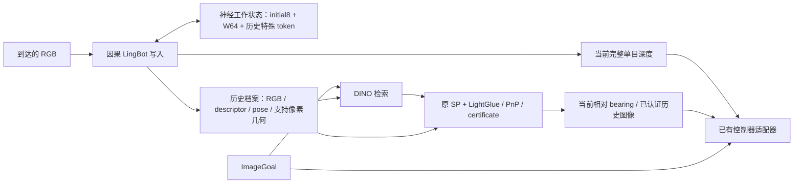

# Geometric Episodic Memory

2026-09-17 整理说明：本页的 `.diagnostics/` 路径指本地实验记录，不随 Git 发布；
部分大型数组已归档，恢复方式见 [存储说明](../../../../docs/LOCAL_STORAGE.md)。
这些存储设置也已接入真机仓库的静止延迟回放，生产默认保持不变，见
[真机接入记录](https://github.com/AlanZhu2006/MemNav-RealWorld/blob/main/REALWORLD_MEMORY_STORAGE_SYNC_20260916_CN.md)。

`MemNavAgent.memory` 是每个 episode 的中央记忆对象。它统一管理在线工作状态、历史证据、当前深度与目标会话；Python 兼容方法和 HTTP 接口调用同一个对象。模型权重由 agent 持有，记忆通过弱引用访问，不复制 LingBot 或控制器。

## 目前使用的结构



记忆包含两个生命周期不同的部分：

- **神经工作状态**参与下一观测的几何预测。`native_interval7` 保留原八帧联合初始化，此后每隔七个 RGB 观测提交一帧 KV。所有到达的 RGB 仍做几何预测；非提交帧也参与自己的当前预测，完成后不进入历史 KV。W64 指最近 64 个提交视图的 patch 上下文，不是每隔 64 帧存一次。
- **历史证据档案**在几何首次产生时逐观测写入。保留 RGB、检索描述子、位姿和原读取器需要的几何。`detector_support` 使用冻结 SuperPoint 确定每个关键点的四个双线性采样邻点，同时保留原置信度筛选所需的最小值位置。读出继续使用原 SP/LightGlue/PnP。档案不会因工作 KV 的窗口淘汰而丢失。

当前完整深度单独缓存在 CPU，供 dense readout 使用。历史支持档案只重建查询需要的几何栅格；未保存的像素明确为未知。目标查询直接读取档案，不重新运行历史 LingBot。原有前 40 帧尺度估计使用独立临时状态并恢复在线状态，它属于写入阶段的一次标定。

## 配置与验证状态

|配置项|取值|作用与状态|
|---|---|---|
|`memory_mechanism`|`native_interval7`|已有完整验证的原生流写入；与原 SP/LG/PnP、控制器连接|
|`memory_geometry_storage`|`detector_support`|已有支持档案和完整 70 组历史的行为保持证据|
|`memory_kv_storage`|`reader_precision`|保存 attention 实际读取的 BF16 K/V；已有完整模型、API、连续导航和成本验证|
|`memory_kv_storage`|`paged_bf16`|FA2 分页完整模型阶段已完成；观察到写入加速，峰值显存未下降且几何不完全等价，仍为实验配置|
|`memory_kv_storage`|`int8_storage`|固定 INT8 窗口存储、逐层融合 BF16 解码与原 SDPA；已完成两条全长模型和四场景连续导航验证，数值有差异，仍为实验配置，见 [INT8.md](INT8.md)|
|`memory_kv_storage`|`lossless_bf16`|按 256 个值保存 BF16 指数位平面，恢复原始位后交给原 SDPA；已有 1,948 帧完整模型等价证据和后续解码验证，见 [LOSSLESS.md](LOSSLESS.md)|

公共默认值仍为 `legacy` / `dense` / `native`。明确选择候选配置：

```python
agent = MemNavAgent(
    ..., certified_relocalization_matcher=matcher,
    certified_reference_depth_source="online_history",
    memory_mechanism="native_interval7",
    memory_geometry_storage="detector_support",
    memory_kv_storage="reader_precision",
    flow_gate="off",
)
gem = agent.memory
frame = gem.write(jpeg_bytes)
depth_payload = gem.read_dense()
proposal = agent.plan(goal_jpeg_bytes, retrieval_only=True)
proof = gem.read_sparse(goal_jpeg_bytes, proposal["certified_visual_candidates"])
```

旧 `legacy/canonical` 查询会因果重放选中历史帧；它是保留的兼容配置，不能用来描述上述 `native_interval7/online_history` 的当前档案读出。旧 `connected_reciprocal` 坐标连接研究记录见 [EPISODIC.md](EPISODIC.md)，不代表已经采用的新中央记忆算法。

## 所有权和实现

|文件|职责|
|---|---|
|`memory.py`、`bindings.py`|中央所有权与旧字段别名，同一份状态|
|`episodic.py`、`connected.py`|原生流写入、首次几何发布、标定和失败状态|
|`support.py`、`archive.py`|历史支持/完整栅格档案|
|`read_precision.py`|保持原 SDPA 计算的 BF16 键存储|
|`paged.py`|按需增长的分页 KV、临时帧事务、原始初始化和 FA2 读取|
|`int8_state.py`、`int8.py`|固定 INT8 工作状态、共享 CUDA 解码暂存、原 SDPA 适配|
|`lossless_state.py`、`lossless.py`|无损 BF16 位平面存储、按块恢复和原 SDPA 适配|
|`descriptor_cache.py`|按 episode 增量上传不可变的 FP32 检索描述子，保持原连续批次与相似度计算|
|`reactivation.py:isolated_stream`|共享权重、隔离临时状态，异常时也恢复原容器|
|`dense.py`、`sparse.py`|原当前深度、目标检索、SP/LG/PnP、证书与 bearing|

`MemoryField` 将 `agent.cam_pose`、`agent.dino_cls` 等旧字段映射到同一个记忆。`reset` 开始新 episode 并清空工作状态。A→B→A 目标切换保留历史，重新建立 A 的查询边界；接受和拒绝分别随目标会话缓存，已接受目标的 bearing 使用最新当前位姿更新。目标图像不写入已观察历史。缺失档案、计算失败和几何拒绝是不同状态；失败后必须 reset，不切换算法后端。

分页实现与其边界见 [PAGED.md](PAGED.md)。`/memory_status` 对该配置同时报告有效 KV、实际分配页池、工作区和增长复制量，避免把有效容量估计写成整进程显存。

## 描述子的增量读取

`EpisodicGEM` 在第一次检索时创建一个连续的设备描述子缓冲区。后续查询只上传新增观测的 CPU FP32 描述子；同一帧重复查询和目标切换不再次上传旧历史。缓冲区在 episode reset 时释放，容量不足时按倍数增长。CPU 上的首次观测描述子保持原样，KV 和 SP/LightGlue 特征不进入这个缓冲区。

读出仍向原 `cosine_similarity` 提供完整、连续的 `[1, T, 1024]` 输入，并沿用已有的候选缓存和因果边界。单独计算当前行会改变 GPU 浮点归约，因此未采用该捷径。这项改动省去重复的 CPU 堆叠和主机到 GPU 搬运，GPU 相似度计算仍随历史长度增长。

`memory_status.descriptor_read_cache` 单独报告有效容量、实际分配字节、累计上传字节与扩容复制字节。它是额外的描述子缓存开销，不计入 KV 压缩率。已有 1,948 帧数据上，一次建立缓存需 7.61 MiB；逐步增长的公共 API 检查分配 8 MiB。后续增长最多保留不足两倍的有效描述子容量；扩容期间新旧缓冲区暂时共存。

验证和限定范围见[增量读取记录](../../../../.diagnostics/gem_cached_retrieval_20260915/RESULT.md)。29 项 CPU 检查、72 组 GPU 输入/相似度比较与 11 步 API 序列通过；已有缓存的描述子检索部分从 1.848 ms 降至 0.087 ms（1,948 帧、共享 GPU、配对测量），不代表包含图像编码和 SP/LG/PnP 的完整查询或闭环导航速度。

## 已有证据与限制

- 当前存储/读出与连续链证据：`.diagnostics/gem_connected_memory_20260913/`。
- HPC 完整支持档案证据：[HPC_COMPLETION.md](../../../../.diagnostics/gem_paged_memory_20260914/HPC_COMPLETION.md)。
- 新分页实现验证：`.diagnostics/gem_paged_memory_20260914/`；旧影子 attention 结果不代替完整模型结果。

支持档案和 KV 存储优化已模块化；它们不自动解决长程漂移或使全部历史内存固定。历史档案仍增长，当前原生协议仍限制到 320 个提交视图。分页是存储/读取工程优化，尚不构成额外导航或新压缩算法贡献。真实机器人验证暂时不在本阶段范围内。论文表格和默认配置不随这些工程试验自动替换。
